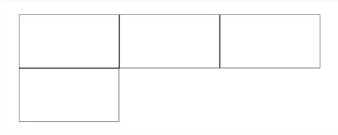

# Css

- [**`1.怎么让一个不定宽高的div垂直水平居中`**](#怎么让一个不定宽高的div垂直水平居中)
- [**`2.清除浮动的方法`**](#清除浮动的方法)
- [**`3.块级格式化上下文`**](#块级格式化上下文)
- [**`4.CSS隐藏元素的几种方式及区别`**](#CSS隐藏元素的几种方式及区别)
- [**`5.什么是FOUC?如何避免`**](#什么是fouc)
- [**`6.css3有哪些新特性`**](#css3有哪些新特性)
- [**`7.::before和:before中双冒号和单冒号`**](#伪类和伪元素)
- [**`8.如果需要手动写动画，你认为最小时间间隔是多久，为什么?`**](#动画时间间隔)
- [**`8.stylus/sass/less区别?`**](#sass和其他的区别)
- [**`9.postcss的作用?`**](#postcss的作用)
- [**`10.flex布局和grid布局`**](#flex布局和grid布局)


## 怎么让一个不定宽高的div垂直水平居中
### 1.flex
- 只需要在父盒子设置：`display: flex; justify-content: center;align-items: center;`

### 2.使用CSS3 transform
- 1.父盒子设置: `position:relative`
- 2.Div 设置: `transform: translate(-50%，-50%);position: absolute;top: 50%;left: 50%;`

### 3.使用 display:table-cell 方法
- 1.父盒子设置:`display:table-cell; text-align:center;vertical-align:middle;`
- 2.Div 设置: `display:inline-block;vertical-align:middle;`


## 清除浮动的方法

### 1.给父级定高度:不推荐使用

### 2.使用空元素
```javascript
<div style="clear:both;"></div>
//  优点：浏览器支持好 缺点：多出了很多空的DIV标签，如果页面中浮动模块多的话，就会出现很多的空置DIV。（不推荐使用）
```

### 3.让父级也一并浮动:又会产生新的浮动问题,不推荐使用

### 4.父级d定义display:table
>  缺点：会产生新的未知问题,不推荐使用


### 5.父级设置 overflow：hidden、auto
> 原理：这个方法的关键在于触发了BFC。在IE6中还需要触发 hasLayout（zoom：1） 优点：代码简介，不存在结构和语义化问题 缺点：无法显示需要溢出的元素（亦不太推荐使用）

### 6.父级d定义伪类:after 和 zoom
```javascript
.clearfix:after {
    content:”\200B”; 
    display:block; 
    height:0; 
    clear:both;
 }
.clearfix {
  *zoom: 1;
}
// hack IE6，IE7就可以了
// 原理和方法2有点类似，zoom(IE转有属性)可解决ie6,ie7浮动问题 优点：结构和语义化完全正确,代码量也适中，推荐使用。
```

## 块级格式化上下文
> 有三种定位方案——普通流 (Normal Flow) 、浮动 (Floats) 和绝对定位 (Absolute Positioning)。BFC 正是属于普通流的，因此它对兄弟元素也不会造成什么影响。
### 1.BFC是什么
> 从样式上看，具有 BFC 的元素与普通的容器没有什么区别，但是从功能上，具有 BFC 的元素可以看作是隔离了的独立容器，容器里面的元素不会在布局上影响到外面的元素，并且 BFC 具有普通容器没有的一些特性，例如可以包含浮动元素，上文中的第二类清除浮动的方法（如 overflow 方法）就是触发了浮动元素的父元素的 BFC ，使到它可以包含浮动元素，从而防止出现高度塌陷的问题。
> 简单来说，BFC 就是一种属性，这种属性会影响着元素的定位以及与其兄弟元素之间的相互作用。


### 2.如何触发BFC
- 1.浮动元素，float 除 none 以外的值
- 2.绝对定位元素，position（absolute，fixed）
- 3.display 为以下其中之一的值 inline-blocks，table-cells，table-captions
- 4.overflow（hidden，auto，scroll）

### 3.BFC的特性
[**BFC的demo**](http://kayosite.com/demo/bfc.html#bfc-1)
#### 3.1 BFC会阻止外边距折叠
> 比如用overflow（hidden，auto，scroll） 消除margin重叠

#### 3.2 BFC可以包含浮动的元素
> 比如用overflow（hidden，auto，scroll） 清浮动

#### 3.3 BFC可以阻止元素被浮动元素覆盖
> 比如用overflow（hidden，auto，scroll） 可以阻止元素被浮动元素覆盖


## CSS隐藏元素的几种方式及区别
### 1.display:none
> 元素在页面上将彻底消失，元素本来占有的空间就会被其他元素占有，也就是说它会导致浏览器的**重排**和**重绘**。
> 不会触发其点击事件

### 2.visibility:hidden
> 和`display:none`的区别在于，元素在页面消失后，其占据的空间依旧会保留着，所以它只会导致浏览器**重绘**而不会**重排**。
> 无法触发其点击事件

### 3.opacity:0
> 和`visibility:hidden`的区别是它可以触发点击事件

### 4.设置height，width等盒模型属性为0
> 简单说就是将元素的margin，border，padding，height和width等影响元素盒模型的属性设置成0，如果元素内有子元素或内容，还应该设置其overflow:hidden来隐藏其子元素。

### 5.others
> 设置元素的position与left，top，bottom，right等，将元素移出至屏幕外
> 设置元素的position与z-index，将z-index设置成尽量小的负数


## 什么是fouc
- `Flash Of Unstyled Content`：用户定义样式表加载之前浏览器使用默认样式显示文档，用户样式加载渲染之后再从新显示文档，造成页面闪烁。
- 解决方法：把样式表放到文档的`head`

## css3有哪些新特性
- 1.新增各种`css`选择器
- 2.圆角 `border-radius`
- 3.多列布局
- 4.阴影和反射
- 5.文字特效`text-shadow`
- 6.线性渐变
- 7.旋转`transform`

## 伪类和伪元素
- 单冒号(:)用于`CSS3`伪类，双冒号(::)用于`CSS3`伪元素

## 动画时间间隔
- 多数显示器默认频率是`60Hz`，即1秒刷新60次，所以理论上最小间隔为`1/60＊1000ms ＝ 16.7ms`

## sass和其他的区别
- 1.均具有“变量”、“混合”、“嵌套”、“继承”、“颜色混合”五大基本特性
- 2.`Scss`和`LESS`语法较为严谨，`LESS`要求一定要使用大括号“{}”，`Scss`和`Stylus`可以通过缩进表示层次与嵌套关系
- 3.`Scss`无全局变量的概念，`LESS`和`Stylus`有类似于其它语言的作用域概念
- 4.`Sass`是基于`Ruby`语言的，而`LESS`和`Stylus`可以基于`NodeJS NPM`下载相应库后进行编译；

## postcss的作用
- 可以直观的理解为：它就是一个平台。为什么说它是一个平台呢？因为我们直接用它，感觉不能干什么事情，但是如果让一些插件在它上面跑，那么将会很强大
`PostCSS` 提供了一个解析器，它能够将 `CSS` 解析成抽象语法树
- 通过在 `PostCSS` 这个平台上，我们能够开发一些插件，来处理我们的`CSS`，比如热门的：`autoprefixer`


## flex布局和grid布局
> 用flex和grid实现如下布局
<p align="center">
    
</p>   
```html
<html>
  <head>
    <style>
      /* flex */
     .box {
       display: flex;
       flex-wrap: wrap;
       width: 100%;
     }
     .box div {
        width: calc(100% / 3 - 2px);
        height: 100px;
        border: 1px solid black;
     }

     /* grid */
     .box {
        display: grid;
        grid-template-columns: 1fr 1fr 1fr;
        width: 100%;
     }

     .box div {
        height: 100px;
        border: 1px solid black;
     }
    </style>
  <head>
  <body>
    <div class="box">
      <div></div>
      <div></div>
      <div></div>
      <div></div>
    </div>	
  <body>
</html>
```